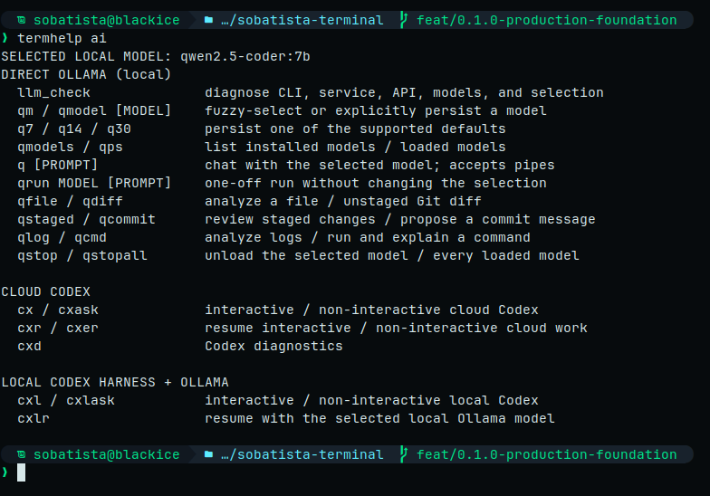

<div align="center">

# ❄ SoBatista Terminal

<p><em>Black Ice for Bash, Terminator, local AI, and Codex</em></p>

A restrained, recoverable Linux terminal environment for engineering and
authorized security work.

[](https://github.com/SoBatista/sobatista-terminal/actions/workflows/ci.yml)
[](https://github.com/SoBatista/sobatista-terminal/actions/workflows/security.yml)
[](CHANGELOG.md)
[](LICENSE)

<br>


</div>

Version: `0.1.0`

> [!NOTE]
> Screenshots are real, sanitized captures from the configured Terminator
> environment; this project never fabricates terminal images. The hero above
> uses [screenshot mode](docs/customization.md#safe-screenshot-identity) for a
> safe identity. See [the capture workflow](docs/screenshots.md).

## Why this setup

SoBatista Terminal turns a clean Bash account into a coherent daily workspace:

- SoBatista Black Ice colors with graphite surfaces, terminal green, ice cyan,
  accessible status colors, and no pastel rainbow prompt.
- Complete Bash, Readline, Terminator, and modular Starship configuration.
- Safe Git shortcuts, cross-distribution updates, system inspection, and an
  authorization-labeled security toolkit.
- A built-in `termhelp` system and fuzzy `cmdhelp` command discovery.
- Direct, private Ollama/Qwen commands independent from Codex.
- Clearly separated cloud Codex and local Ollama-backed Codex workflows.
- Idempotent installation with timestamped backups, manifests, dry runs,
  conservative uninstall, and selected rollback.
- Bats behavior tests, portable smoke tests, pinned CI actions, secret scanning,
  and deterministic SemVer releases.

## Supported Linux distributions

Support is intentionally limited to these families. Desktop behavior outside
them is not claimed.

| Family | Package manager | Automated coverage | Status |
| --- | --- | --- | --- |
| Debian / Ubuntu / Linux Mint | APT | Ubuntu container smoke + APT adapter tests | Supported |
| Fedora | DNF5 or DNF | Fedora container smoke + adapter tests | Supported |
| Arch Linux | pacman | Arch container smoke + adapter tests | Supported |

Container smoke tests validate Bash/config installation; they do not constitute
full Terminator GUI or GPU/model testing. Linux Mint and Debian share the tested
APT path but are not each boot-tested in CI. Report distribution-specific issues
with the exact release and package-manager version.

## Safe quick start

The primary flow downloads the Git repository, lets you inspect it, validates it,
and only then runs the installer. It does not pipe network content into a shell.

```bash
git clone https://github.com/SoBatista/sobatista-terminal.git
cd sobatista-terminal
git status --short --branch
less install.sh
bash install.sh --self-test
bash install.sh --dry-run
bash install.sh
```

Use `--configs-only` to avoid package or software installation. Use `--yes` only
after reviewing the plan and external installer sources. The 14B and 30B models
are never downloaded unless `--all-models` is explicitly passed.

See [installation](docs/installation.md) for every option, package list, external
installer boundary, and a fully manual configuration install.

## Prerequisites

- Bash 4.3 or newer (associative arrays are used for PATH deduplication).
- A non-root desktop user with `sudo` for explicit package-manager actions.
- One supported distribution family.
- Internet access only when installing packages, tools, fonts, or models.
- Enough disk/RAM/VRAM for the chosen Ollama model. Model requirements vary by
  quantization and runtime; inspect `ollama show MODEL` on your system.

Optional tools degrade gracefully: `fzf`, `zoxide`, `eza`, `bat`, `fastfetch`,
`direnv`, clipboard helpers, Docker, Ollama, and Codex.

## Font and Terminator

The profile uses **JetBrainsMono Nerd Font Mono**. The installer offers the
official Nerd Fonts archive as a user-local install, printing its source and
SHA-256 before extraction.

After installation:

```bash
fc-match 'JetBrainsMono Nerd Font Mono'
terminator -p default
terminator -l AI-Workbench
```

`AI-Workbench` opens one large left pane and two stacked right panes. See
[customization](docs/customization.md) before changing split ratios or colors.

## The Black Ice prompt

The Starship prompt is a single connected Powerline bar. Each segment appears
only when it carries state, so there are never empty capsules or duplicated
separators, and there is no clock:

- **Identity** — distribution glyph and `user@host`.
- **Directory** — the path, shortened to its last three components.
- **Git branch** — only inside a repository.
- **Git state** — only the counters that currently apply.

The prompt character sits on its own line: a green `❯` after success, and a red
`❯` (with the exit code) after a failed command. `cmd_duration` appears only
after a command slower than two seconds.

| Indicator | Meaning | Indicator | Meaning |
| --- | --- | --- | --- |
| `⇡N` | N commits to push | `⇣N` | N commits to pull |
| `⇕⇡A⇣B` | branch diverged | `=N` | N merge conflicts |
| `+N` | N staged | `!N` | N modified |
| `?N` | N untracked | `»N` | N renamed |
| `✘N` | N deleted | `*N` | N stashed |

Green marks progress, amber a dirty working tree, and red a conflict,
divergence, or deletion. `termhelp git` prints the same legend.

For screenshots and demos, replace the real identity with a deterministic
`sobatista@blackice` — without touching your username or hostname, and without
`eval`:

```bash
SOBATISTA_SCREENSHOT_MODE=1 exec bash
```

Normal shells always show your real configured identity.

## Local models: direct Ollama

The selected model is stored with mode `0600` at
`${XDG_CONFIG_HOME:-~/.config}/sobatista-terminal/model`.

```bash
llm_check                    # diagnose Ollama, service, API, and models
qmodels                      # list installed models and current selection
qm                           # fuzzy-select an installed model
q7                           # persist qwen2.5-coder:7b
q14                          # persist qwen2.5-coder:14b
q30                          # persist qwen3-coder:30b
q 'explain this regex'       # direct local prompt
git diff | q 'review this'   # piped local analysis
qrun qwen3-coder:30b 'plan a refactor'  # one-off; selection unchanged
```

`qfile`, `qdiff`, `qstaged`, `qcommit`, `qlog`, and `qcmd` provide focused local
workflows. They call Ollama directly and do not require Codex or OpenAI auth.

## Cloud Codex versus local Codex

The names deliberately expose the trust boundary:

| Workflow | Commands | Provider |
| --- | --- | --- |
| Cloud Codex | `cx`, `cxask`, `cxr`, `cxer`, `cxd` | Normal Codex configuration and OpenAI authentication |
| Local Codex harness | `cxl`, `cxlask`, `cxlr` | Ollama on loopback with the model selected by `qm` |
| Direct local chat | `q` and other `q*` helpers | Ollama directly; no Codex dependency |

The local wrappers use the officially documented Codex `--oss`,
`--local-provider ollama`, and `--model` flags. A sanitized optional example is
provided at [local-qwen.config.toml.example](config/codex/local-qwen.config.toml.example).
It contains no auth, MCP, hook, session, or provider secrets. See the official
[Codex CLI reference](https://developers.openai.com/codex/cli/reference) and
[configuration reference](https://developers.openai.com/codex/config-reference).

## Discover shortcuts

```bash
termhelp                    # fuzzy topic menu (alias: th)
termhelp ai
termhelp git
termhelp updates
cmdhelp                     # fuzzy command picker (alias: ch)
cmdhelp gup                 # alias resolution and definition
```

Topics: `keys`, `ai`, `git`, `shell`, `updates`, `security`, and `discovery`.
The exhaustive public command reference is in [commands](docs/commands.md).



### Complete public command index

Every installed public alias and function is listed here so the README remains
a complete discovery surface; the linked command reference provides arguments,
expansions, safety notes, and conditional-dependency details.

- Navigation, files, and conditional GNU colors: `..`, `...`, `....`, `-`,
  `ll`, `lt`, `lsize`, `pathlines`, `dirsize`, `diskfree`, `meminfo`, `mkcd`,
  `croot`, `backup`, `ls`, and `grep`.
- Git: `g`, `gst`, `ga`, `gap`, `gaa`, `gc`, `gcm`, `gca`, `gd`, `gds`, `gl`,
  `gb`, `gba`, `gsw`, `gsc`, `gr`, `grs`, `gf`, `gp`, `gpf`, `gup`, `gw`,
  `gwl`, and `gwa`.
- Development and containers: `py`, `json`, `watch1`, `venv`, `serve`,
  `serve_lan`, `urlencode`, `d`, `dc`, `dps`, `dcu`, `dcud`, `dcd`, `dcl`, and
  `dex`.
- Administration and updates: `ports`, `routes`, `interfaces`, `failed`,
  `services`, `jboot`, `jfollow`, `topcpu`, `topmem`, `pkg_search`,
  `pkg_install`, `system_update`, `apps_update`, `restartcheck`, `updateall`,
  `updateollama`, `updatecodex`, `updatestarship`, and `qmodels_update`.
- Authorized testing: `headers`, `redirects`, `dns`, `dns_short`, `certinfo`,
  `nmap_services`, `nmap_all_tcp`, `burp_on`, `burp_off`, and `burp_status`.
- Direct Ollama: `llm_check`, `qmodels`, `qmodel`, `qm`, `q7`, `q14`, `q30`,
  `q`, `qrun`, `qfile`, `qdiff`, `qstaged`, `qcommit`, `qlog`, `qcmd`, `qps`,
  `qstop`, and `qstopall`.
- Codex: `cx`, `cxask`, `cxr`, `cxer`, `cxd`, `cxl`, `cxlask`, and `cxlr`.
- Help and optional tools: `termhelp`, `th`, `cmdhelp`, `ch`, `rgall`, `hgrep`,
  `workbench`, `fd`, `bat`, `sysinfo`, `cbcopy`, and `cbpaste`.

> [!WARNING]
> `nmap_*`, TLS, DNS, HTTP, and Burp helpers are for systems you own or are
> explicitly authorized to test. Command convenience never creates permission.

## Updates and restart checks

`system_update` covers APT, DNF/DNF5, or pacman. `apps_update` covers installed
Flatpak, Snap, pipx, and tldr ecosystems. `updateall` runs both, then
`restartcheck`.

Explicit commands update Codex, Ollama, Starship, or installed Ollama models.
Nothing here claims to update AppImages, arbitrary source checkouts, every
language toolchain, browser extensions, or all manually installed software.
Linux filesystem cache is normally beneficial and automatically reclaimed; no
cache-dropping alias is included.

## Backup, uninstall, and restore

Each installation prints its exact backup directory under:

```text
${XDG_STATE_HOME:-~/.local/state}/sobatista-terminal/backups/TIMESTAMP
```

List and inspect backups before restoring:

```bash
bash uninstall.sh --list-backups
bash uninstall.sh --dry-run --restore TIMESTAMP
bash uninstall.sh --restore TIMESTAMP
```

Uninstall removes only files whose SHA-256 still matches the installation
manifest. Modified files are preserved. Backups are never deleted by uninstall.

## Manual installation

For configuration-only installation without the installer:

```bash
install -Dm600 config/bash/bashrc ~/.bashrc
install -Dm600 config/bash/bash_aliases ~/.bash_aliases
install -Dm600 config/bash/inputrc ~/.inputrc
install -Dm600 config/starship/starship.toml ~/.config/starship.toml
install -Dm600 config/terminator/config ~/.config/terminator/config
```

Back up existing targets yourself first. The full manual procedure and package
maps are in [installation](docs/installation.md).

## Customization and screenshots

- [Customization](docs/customization.md): colors, prompt modules, layouts, and
  local overrides.
- [Screenshots](docs/screenshots.md): real-capture requirements, sanitization,
  filenames, dimensions, and optimization.
- [Troubleshooting](docs/troubleshooting.md): fonts, services, models, shells,
  Codex, and rollback.

## Testing

```bash
bash install.sh --self-test          # portable validation; no changes
scripts/self-test.sh                 # full local suite
bats tests                           # behavior tests only
```

CI adds ShellCheck, `shfmt -d`, TOML parsing, Markdown linting, link checking,
Actionlint, secret scanning, and Ubuntu/Fedora/Arch configuration smoke tests.
See [maintenance](docs/maintenance.md) for exact tools and limitations.

## Security, contributing, and releases

- Report vulnerabilities through [the security policy](SECURITY.md), not a
  public issue.
- Read [contributing](CONTRIBUTING.md) and the [code of conduct](CODE_OF_CONDUCT.md).
- Every PR carries exactly one release-impact label, a matching SemVer increment,
  and a reviewed changelog entry. See [maintenance](docs/maintenance.md).
- Planned work is tracked in the [roadmap](ROADMAP.md).

## License

SoBatista Terminal is released under the [MIT License](LICENSE).
